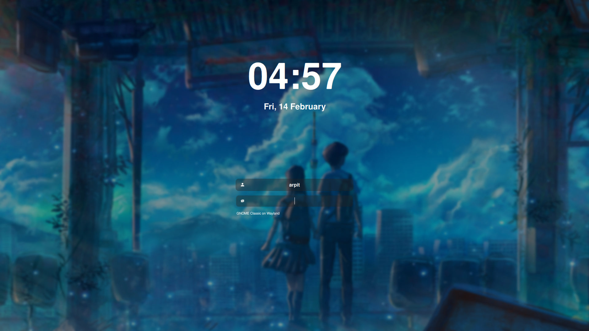

## SDDM Config
```aiignore
Its merely a customisation of Keyitdev/sddm-astronaut-theme, kudos to him.
```
### Preview


### Installation
```shell
git clone 
## Arch
pacman -Sy qt6-svg qt6-virtualkeyboard qt6-multimedia-ffmpeg
```

### Live Preview
```shell
chmod +x ./script.sh
./script.sh #make a simple change now, it will open a window
```